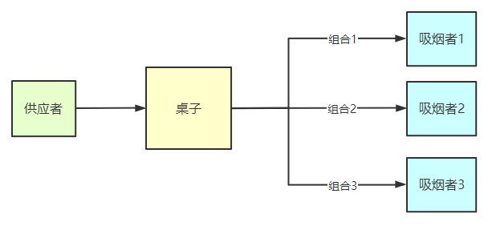

# 吸烟者问题



```c
semaphore offer1 = 0;    //桌上组合一的数量
semaphore offer2 = 0;    //桌上组合二的数量
semaphore offer3 = 0;    //桌上组合三的数量
semaphore finish = 0;    //抽烟是否完成
int i = 0;    //正在吸烟的吸烟者序号

//对于材料提供者
void provider(){
    while(1){
        if(i == 0){
            将组合一放桌上；
            wait(offer1);
        } 
        else if(i == 1){
            将组合二放桌上；
            wait(offer2);
        } 
        else if(i == 2){
            将组合三放桌上；
            wait(offer3);
        }
        i = (i + 1) % 3;
        P(finish);
    }
}

//对于三位吸烟者
void smoker1(){
    while(1){
        P(offer1);
        从桌上拿走组合一，卷烟抽；
        V(finish);
    }
}

void smoker2(){
    while(1){
        P(offer2);
        从桌上拿走组合二，卷烟抽；
        V(finish);
    }
}

void smoker3(){
    while(1){
        P(offer3);
        从桌上拿走组合三，卷烟抽；
        V(finish);
    }
}
```