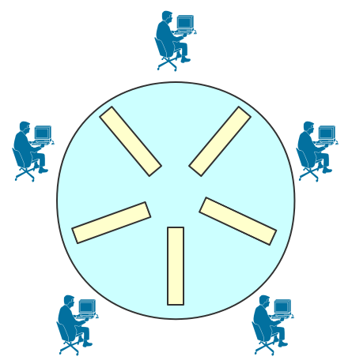

# 哲学家进餐问题



1. 至多4人同时拿起左边筷子
   
    ```c
    semaphore chopstick = {1, 1, 1, 1, 1}; // 每根筷子对应一个互斥信号量
    semaphore count = 4; // 至多4人同时拿起左边筷子
    cobegin
    	Pi() {
    		while(true) {
    			思考
    			P(count); // 同时拿起左边筷子的人不能超过4个
    			P(chopstick[i]); // 拿起左边的筷子
    			P(chopstick[(i+1)%5]); //拿起右边的筷子
    			吃饭
    			V(chopstick[(i+1)%5]);
    			V(chopstick[i);
    			V(count);
    		}
    	}
    coend
    ```
    
2. ****只有左右两边的筷子都能使用时，才允许拿起筷子进餐****
   
    ```c
    semaphore chopstick = {1, 1, 1, 1, 1}; // 每根筷子对应一个互斥信号量
    cobegin
    	Pi() {
    		while(true){
    			思考
    			P(chopstick[i], chopstick[(i+1)%5]);
    			吃饭
    			V( chopstick[(i+1)%5], chopstick[i]);
    		}
    	}
    coend
    ```
    
3. ****奇数号哲学家先拿左边的筷子再拿右边的筷子，偶数号哲学家操作相反****
   
    ```c
    semaphore chopstick = {1, 1, 1, 1, 1}; // 每根筷子对应一个互斥信号量
    cobegin
    	Pi() {
    		while(true){
    			思考
    			if (i % 2 == 1) { // 奇数号科学家先左后右
    				P(chopstick[i]);
    				P(chopstick[(i+1)%5];
    				吃饭
    				V(chopstick[(i+1)%5];
    				V(chopstick[i]);
    			}
    			else {// 奇数号科学家先右后左
    				P(chopstick[(i+1)%5];
    				P(chopstick[i]);
    				吃饭
    				V(chopstick[i]);
    				V(chopstick[(i+1)%5];
    			}
    		}
    	}
    coend
    ```