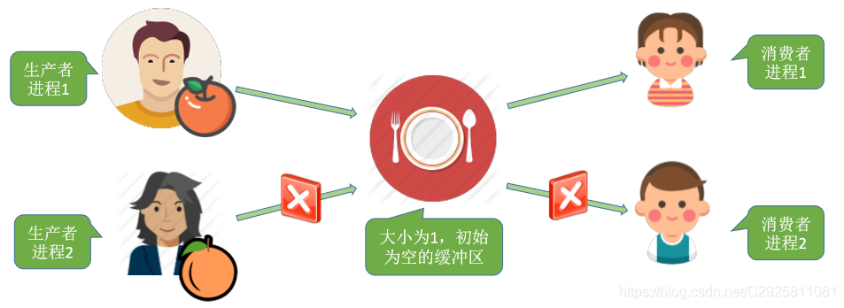

# 多生产者和多消费者问题



```c
semaphore plate=1, apple=0, orange=0;
dad(){
		while(1){
				prepare an apple;
				P(plate);
				put the apple on the plate;
				V(apple);
		}
}

mom(){
		while(1){
				prepare an orange;
				P(plate);
				put an orange on the plate;
				V(orange);	
		}
}

son() {
		while(1){
				P(orange);
				take an orange from the plate;
				V(plate);
				eat the orange;
		}
}

daughter() {
		while(1){
				P(apple);
				take an apple from the plate;
				V(plate);
				eat the apple;
		}
}
```