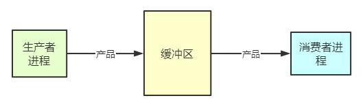

# 生产者和消费者问题



```c
semaphore mutex = 1;//互斥信号量，实现对缓冲区的互斥访问
semaphore empty = n;//同步信号量，表示空闲缓冲区的数量
semaphore full = 0; //同步信号量，表示产品的数量，也即非空缓冲区的数量

producer () {
while (1) {
				生产一个产品;
				P(empty);         //消耗一个空闲缓冲区②
				P(mutex);         //实现互斥是在同一进程中进行一对PV操作①
				把产品放入缓冲区;
				V(mutex);
				V(full);          //增加一个产品*
				}
}
consumer () {
while(1){
				P(full);          //消耗一个产品（非空闲缓冲区）*④
				P(mutex);         //③
				从缓冲区取出一个产品;
				V(mutex);
				V(empty);
				使用产品;        //增加一个空闲缓冲区
				}
}
```

生产者每次要消耗（P）一个空闲缓冲区，并生产（V）一个产品。消费者每次要消耗（P）一个产品，并释放一个空闲缓冲区（V），往缓冲区放入/取走产品需要互斥。刚开始空闲缓冲区的数量为n，非空闲缓冲区（产品）的数量为0。