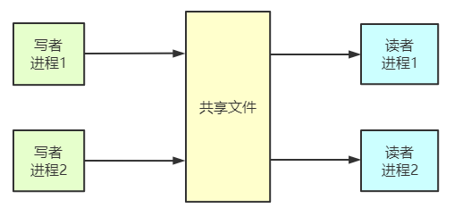

# 读者-写者问题



```c
semaphore rmutex = 1;    //用于保证对 count 变量的互斥访问
semaphore wmutex = 1;    //用于实现对文件的互斥访问，表示当前是否有进程在访问共享文件
int readcount = 0;    //记录当前有几个读进程在访问文件

//对于读者
void reader(){
    do{
        P(rmutex);    //reader 进程互斥访问 readcount
        if(readcount == 0)    //第一个 reader 进程开始读
        {
            P(wmutex);    //给共享文件“加锁”
        }
        readcount++;    //访问文件的 reader 进程数加 1
        V(rmutex);
        perform read operation;    //读文件
        P(rmutex);   //各个 reader 进程互斥访问 readcount
        readcount--;    //访问文件的 reader 进程数减 1
        if(readcount == 0)
        {
            V(wmutex);    //最后一个 reader 进程“解锁”
        }
        V(rmutex);
    }while(TRUE);
}
//对于写者
void writer()
{
    do{
        P(wmutex);    //写之前“加锁”
        perform write operation;
        V(wmutex);    //写之后“解锁”
    }while(TRUE);
}
```