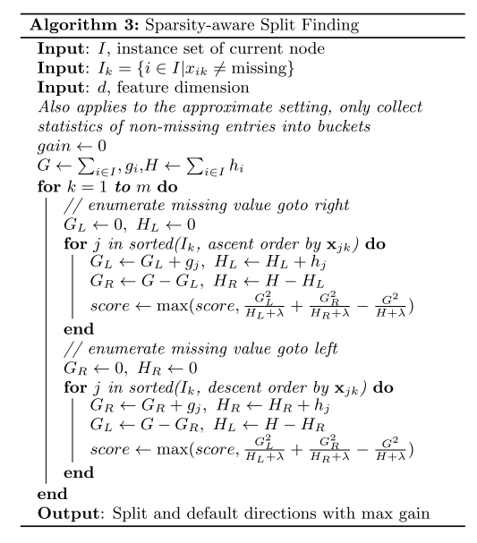

# XGBoost:A Scalable Tree Boosting System

@Tianqi Chen

## Main Content

Tree boosting is a highly effective and widely used machine learning method. In this paper, we describe a scalable endto-end tree boosting system called XGBoost, which is used widely by data scientists to achieve state-of-the-art results on many machine learning challenges. We propose a novel sparsity-aware algorithm for sparse data and weighted quantile sketch for approximate tree learning. More importantly, we provide insights on cache access patterns, data compression and sharding to build a scalable tree boosting system. By combining these insights, XGBoost scales beyond billions of examples using far fewer resources than existing systems.

## Innovations

- design and build **a highly scalable end-to-end tree boosting system.**
- propose **a theoretically justified weighted quantile sketch for efficient proposal calculation.**
- introduce **a novel sparsity-aware algorithm for parallel tree learning**.
- propose **an effective cache-aware block structure for out-of-core tree learning**.

## Paceline

- review tree boosting and introduce a regularized objective
- describe the split finding methods as well as the system design
- Related work
- Detailed end-to-end evaluations

### Regularized objective

$$
\begin{equation} 
\Gamma(\phi) = \sum_il(\hat y_i,y_i) +\sum_k\Omega(f_k)
\end{equation}
$$

$$
\Omega (f) = \gamma T+\frac{1}{2}\lambda|\omega|^2
$$

- Each $f_k$ corresponds to an independent structure $q$ and leaf weights $\omega$ .
- Here $l$ is a differentiable convex loss function ,and prediction $\hat y_i$ ,target $y_i$ .
- The term $\Omega$ penalizes the complexity ,with number of leaves $T$ and weights of leaf $\omega$.
- When the regularization parameter is set to zero, the objective falls back to the traditional gradient tree boosting.

### Approximation

$$
\begin{equation} 
\hat\Gamma^{(t)} = \sum_i^n [l(y_i,\hat y^{(t-1)})+g_if_t(x_i)+\frac{1}{2}h_if_i^2(x_i)] +\Omega(f_t)
\end{equation}
$$

where $g_i=\partial_{\hat y^{(t-1)}}l(y_i,\hat y^{(t-1)})$ and $h_i=\partial^2_{\hat y^{(t-1)}} l(y_i,\hat y^{(t-1)})$。

then we can rewrite the Eq(2) expanding $\Omega$ as follows:

$$
\begin{equation}
\begin{split}
\hat \Gamma^{(t)} &= \sum_{i=1}^n[g_if_t(x_i)+\frac{1}{2}h_if_i^2(x_i)] +\gamma T+\frac12 \lambda\sum_{j=1}^T\omega^2_j\\
&=\sum_{j=1}^T[(\sum_{i\in I_j}g_i)\omega_j+\frac12(\sum_{i\in I_j}h_i +\lambda)\omega_j^2]+\gamma T
\end{split}
\end{equation}
$$

then we can compute the optimal weight $\omega^*_j$ of leaf  $j$ by

$$
\omega^*_j=-\frac{\sum_{i\in I_j}g_i}{\sum_{i\in I_j}h_i+\lambda}
$$

The $\lambda$ here is used to control the size of the weight ($\omega$), so that the gradient descent span is not too large, which will reduce the fitting speed, but does not affect the weight of the final result ($\omega$)。

### Shrinkage and Column Subsampling

- **Shrinkage** scales newly added weights by a factor $\eta$ after each step of tree boosting, **Similar to a learning rate** .
- C**olumn** **(feature) subsampling :**using column sub-sampling prevents over-fitting even more so than the traditional **row sub-sampling** (which is also supported). The usage of column sub-samples also speeds up computations of the parallel algorithm described later .

## Split Finding Algorithms

### Basic exact greedy algorithm

first sort the data according to feature values and visit the data in sorted order to accumulate the gradient statistics for the structure score in Eq as follow:

$$
\Gamma_{split} = \frac12[\frac{(\sum_{i \in I_L }g_i)^2}{\sum_{i\in I_L}h_i+\lambda}+\frac{(\sum_{i \in I_R }g_i)^2}{\sum_{i\in I_R}h_i+\lambda}-\frac{(\sum_{i \in I }g_i)^2}{\sum_{i\in I}h_i+\lambda}]-\gamma
$$

### Sparsity-aware Split Finding

where $m$ represent the number of the trees，$R,L$ represent the side of the splited dataset.

**The presented algorithm treats the non-presence as a missing value and learns the best direction to handle missing values.**

## Structure Design

### Column Block for Parallel Learning

we propose to store the data in in-memory units, which we called block .

Collecting statistics for each column can be parallelized,
giving us a parallel algorithm for split finding .

### Cache-aware Acess

we allocate an internal buffer in each thread, fetch the gradient statistics into it, and then perform accumulation in a mini-batch manner .

### Blocks for Out-of-core Computation

- Block Compression
- Block Sharding

[https://dl.acm.org/doi/pdf/10.1145/2939672.2939785](https://dl.acm.org/doi/pdf/10.1145/2939672.2939785)

[GBDT](XGBoost%20A%20Scalable%20Tree%20Boosting%20System%207ac99891fca943459e4ec20518fdec82/GBDT%2034700b50e5484946b53a60b748d7c153.md)