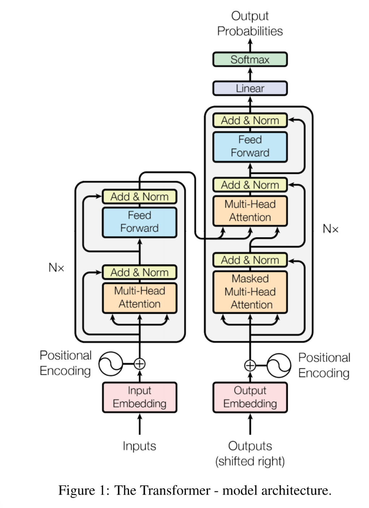

# Attention Is All you need

## Main Content

The dominant **sequence transduction** models are based on complex recurrent or
convolutional neural networks that include an encoder and a decoder. The best
performing models also connect the encoder and decoder through an attention
mechanism. We propose a new simple network architecture, the Transformer,
based solely on attention mechanisms, dispensing with recurrence and convolutions
entirely.

## Background

- Most Neural Net use convolutional neural networks ,this makes
it more difficult to learn dependencies between distant positions.
- Self-attention

## Insight

- In this work we propose the Transformer, a model architecture eschewing recurrence and instead relying entirely on an attention mechanism to draw global dependencies between input and output.

## **Model Architecture**

### Encoder and Decoder Stacks

abstract:the encoder maps an input sequence of symbol representations $(x_1,\dots, x_n)$ to a sequence of continuous representations $z = (z_1,\dots, z_n)$. Given z, the decoder then generates an output sequence $(y_1,\dots, y_m)$ of symbols one element at a time. At each step the model is auto-regressive, consuming the previously generated symbols as additional input when generating the next.

1. Encoder
   
    The encoder is composed of a stack of N = 6 identical layers. Each layer has two
    sub-layers. The first is a multi-head self-attention mechanism, and the second is a simple, position-wise fully connected feed-forward network.
    
    We employ a residual connection  around each of the two sub-layers, followed by layer normalization . That is, the output of each sub-layer is  $LayerNorm(x + Sublayer(x))$, where $Sublayer(x)$ is the function implemented by the sub-layer itself. To facilitate these residual connections, all sub-layers in the model, as well as the embedding layers, produce outputs of dimension dmodel = 512.
    
2. Decoder
   
    The decoder is also composed of a stack of N = 6 identical layers. In addition to the two sub-layers in each encoder layer, the decoder inserts a third sub-layer, which performs multi-head attention over the output of the encoder stack. Similar to the encoder, we employ residual connections around each of the sub-layers, followed by layer normalization.
    
    
    

### Attention