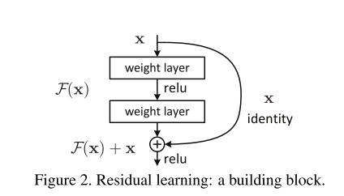
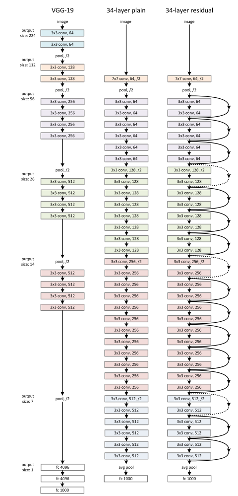
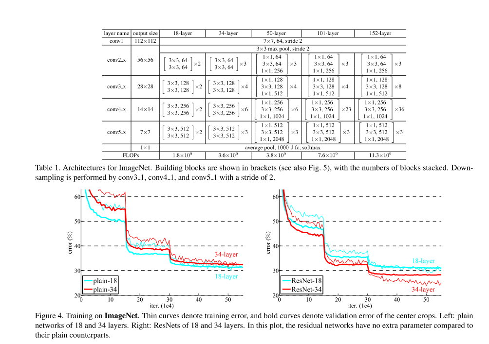
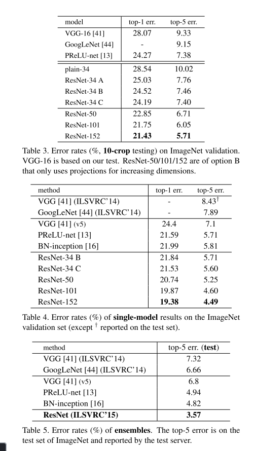

# Deep Residual Learning for Image Recognition

@Kaiming He Xiangyu Zhang Shaoqing Ren Jian Sun

## Main Content

Deeper neural networks are more difficult to train. We
present a residual learning framework to ease the training of networks that are substantially deeper than those used previously. We explicitly reformulate the layers as learning residual functions with reference to the layer inputs, instead of learning unreferenced functions. We provide comprehensive empirical evidence showing that these residual networks are easier to optimize, and can gain accuracy from considerably increased depth. 

### To Solve

1. vanishing/exploding gradients.
2. with the network depth increasing, accuracy gets saturated (which might be unsurprising) and then degrades rapidly.

**old method:normalized initialization and intermediate normalization layers**

### Insight

Formally, denoting the desired underlying mapping as $H(x)$, we let the stacked nonlinear layers fit another mapping of $**F(x) := H(x)−x.$** The original mapping is recast into  $F(x)+x$. We hypothesize that it is easier to optimize the residual mapping than to optimize the original, unreferenced mapping.

merits:①easy to optimize,②easily enjoy accuracy gains from greatly increased depth.

Related Work:R**esidusal**,S**hortcut Connection.**

### Compare

